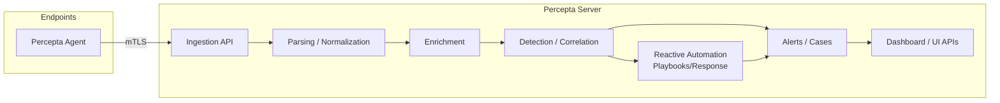

# Percepta Reactive SIEM

Percepta is a **Reactive SIEM** built as a cybersecurity Final Year Project (FYP). It is designed to demonstrate an end-to-end SOC workflow: collecting telemetry from endpoints, ingesting and normalizing events, applying rule-based detection/correlation, producing alerts/cases, and enabling reactive/automated response.

This repository contains the **agent**, **server**, shared contracts, deployment tooling, and detailed documentation under `docs/`.

## Why This Repo Exists (TL;DR)

Security teams need visibility + context + action. Percepta aims to provide:

- **Real-time ingestion** from endpoints/integrations
- **Normalization/enrichment** for consistent event structure
- **Rule-based detection/correlation** to generate meaningful alerts
- **Investigation workflow** (alerts/cases) with operational dashboards
- **Reactive automation** via playbooks/response actions (where configured)

## Key Features

- **Agent + Server** architecture (Rust)
- **mTLS** enrollment/identity (RSA-2048) for secure agent/server communication
- Parsing, normalization, enrichment, and correlation pipeline
- Alerting/cases + operational views for investigations
- Docker-first local deployment via `docker-compose.yml`

## Repository Structure

- `agent/` — endpoint agent
- `server/` — backend services + APIs + dashboard assets
- `shared/` — shared crates/proto/contracts
- `docs/` — system documentation and FYP report sources
- `deploy/` — deployment scripts and service units
- `tools/` — helper utilities/scripts

## Architecture

### High-Level System View



### Data Flow (Conceptual)

1. **Collect** — agent collects endpoint telemetry (logs/system signals) and forwards events.
2. **Ingest** — server receives events over authenticated/authorized channels.
3. **Normalize** — parsing/normalization produces a consistent event shape.
4. **Enrich** — context is attached (host metadata, identity hints, etc.).
5. **Detect/Correlate** — rules/correlation generate alerts.
6. **Investigate** — operators review alerts/cases via dashboard APIs.
7. **Respond** — optional playbooks automate/react to certain detections.

> Exact ports, env vars, and pipeline stage details live in `docs/` (see “Documentation”).

## Technology Stack

- **Rust** — core agent + server implementation
- **Docker / Docker Compose** — local deployment
- **Protocol Buffers** — shared contracts (under `shared/`)

## Getting Started

### Prerequisites

- Rust toolchain (`rustup`, stable toolchain recommended)
- Docker + Docker Compose

### Option A — Run with Docker (Recommended)

From repo root:

```bash
docker-compose up -d
```

Then review logs:

```bash
docker-compose logs -f
```

### Option B — Run Natively (Dev)

Server:

```bash
cd server
cargo run
```

Agent:

```bash
cd agent
cargo run
```

> Some components may require dependent services (database/queues/storage) depending on your configuration. When in doubt, use Docker Compose.

## Configuration

Configuration is intentionally documented in `docs/` to avoid guessing values in the README.

- Environment variables and ports: see `docs/` (API endpoints / env var catalog)
- Security/RBAC model: see `docs/`
- Enrollment / identity / certificate lifecycle: see `docs/`

## How to Use (Typical Workflow)

1. Start the stack (Docker Compose or native).
2. Start an agent and ensure it can connect to the server (mTLS enrollment/identity docs).
3. Generate or ingest events.
4. Confirm events appear in the pipeline and detection produces alerts.
5. Investigate via dashboard APIs/UI.
6. (Optional) enable reactive automation/playbooks for response actions.

## Development

### Build

```bash
cargo build
```

### Test

```bash
cargo test
```

If you want to test specific crates:

```bash
cd server && cargo test
cd agent && cargo test
```

## Security Notes

- This project includes security plumbing (mTLS, identity/enrollment). Treat any included certs/config as **development defaults**.
- Rotate secrets and certificates before using in real environments.
- Do not commit real secrets to the repository.

## Documentation

Start with `docs/`. The docs cover:

- System architecture and flows
- Ingestion → parsing/normalization/enrichment pipeline
- Rule engine / correlation / alerting
- RBAC/security model
- Deployment/runbooks and operational guidance

